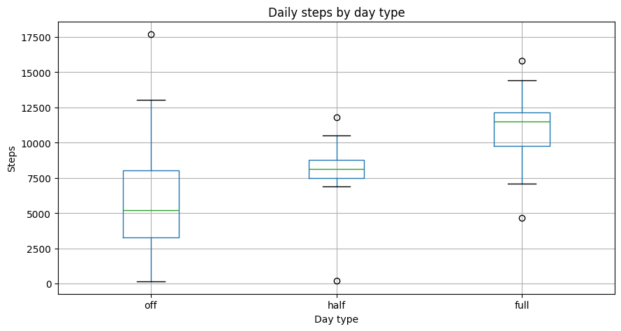
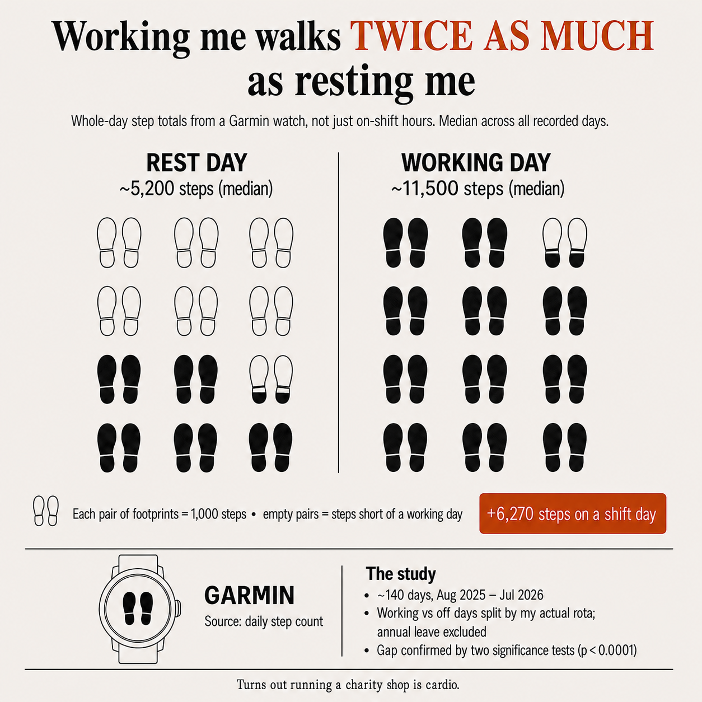

# Step-Count Analysis: Working Days vs Days Off

Do I walk more on working days than on days off, how big is the gap, and is it
statistically real? A short end-to-end data project built on my own Garmin and
work-rota data.

I work as a shop manager at the British Red Cross, a role that involves a lot of
moving around the shop floor. This project set out to quantify that: does the job
actually show up in my daily step count, and by how much?

## Result

| Day type      | Median steps/day |
|---------------|-----------------:|
| Day off       | ~5,200           |
| Half shift    | ~8,000           |
| Full shift    | ~11,500          |

On a full working day I take about **6,300 more steps** than on a day off —
roughly double. The difference is statistically significant (Welch t-test and
Mann-Whitney U, both *p* < 0.0001).

A secondary finding turned out to be more interesting than the headline: days off
have a **much wider spread** than working days. A day off can be anything from the
sofa to a long hike, whereas working days — especially half shifts — land in a
tight, predictable band. So work doesn't just add steps, it *stabilises* daily
activity. The real sedentary risk sits in the unpredictability of days off.

Note on units: the analysis uses **whole-day** step totals, not just hours on
shift, so "full working day" means the entire day, not the job in isolation.

## Data

Two personal sources, joined on date:

1. **Garmin daily step totals** — from a full Garmin account export
   (GDPR "Export Your Data"). The watch is worn all day, so its counts are more
   complete than the phone's. Analysis is limited to **1 Aug 2025 onwards**, the
   start of my current role, to avoid mixing in an earlier routine.
2. **Work rotas** — monthly shift spreadsheets, exported to CSV, telling me which
   days were full shifts, half shifts, or days off.

Raw data is **not included** in this repository (personal health data and
colleagues' shift information). The code expects the files in a local `data/`
folder, which is git-ignored.

## Method

The pipeline, all in the notebook:

1. **Parse Garmin JSON** — read the daily-summary files straight from the export
   `.zip`, flatten the nested JSON, deduplicate overlapping date ranges.
2. **Parse the rotas** — the messy part. The spreadsheets were filled in by
   different people and are inconsistent: dates glued to weekdays, tables shifted
   by an empty column, one "monthly" file holding three months, Excel's cp1252
   encoding. The parser locates the data *by shape* (the row that looks like
   dates, the row containing my name) rather than by fixed positions, so it
   survives the variation.
3. **Normalise shift codes** — the same shift was written many ways
   (`9-5`, `9am-5pm`, `13-5pm`, `4h -AP`...). These are mapped to three
   categories: `full`, `half`, `off`. Annual leave and unfilled cells are
   excluded on purpose.
4. **Join and test** — inner-join steps to day types, then compare groups with
   two tests (parametric and non-parametric) plus a box plot.

## Notes / limitations

- Step history has gaps from irregular watch syncing. Because the gaps depend on
  syncing habits, not on the type of day, they are missing-at-random with respect
  to the question and don't bias the comparison.
- Whole-day totals mean the "on-shift only" step count isn't isolated here; a
  rough estimate of the work contribution is the full-vs-off gap (~6,300 steps).

## Tools

Python, pandas, SciPy, matplotlib. Data handling designed to keep personal and
third-party information out of the public repo.

---

*Author: Timur Siraziev ([@Timhan78](https://github.com/Timhan78))*
